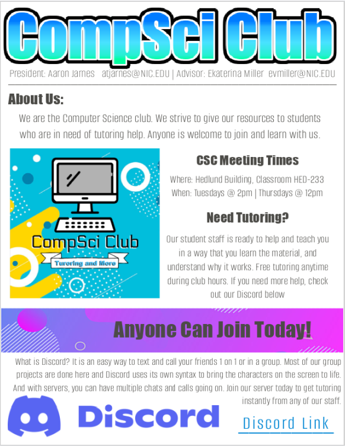

# Comp-Sci-website

This is a mock up website for our NIC's official club website.  
This is to help the developers making the club websites have an easier time implimenting the things we want on our page. 

This is our first iteration of the website, created using PicMonkey.com which is like Adobe Photoshop. 

### What We Want:  
* The web preview defines the boundries we want
  * Use the picture assets in the folder marked "pic"
  * use the text assets marked "Text_Assets.txt"

For any questions or discrepensies please contact me  
CompSci Club President: Aaron Jarnes | atjarnes@NIC.EDU